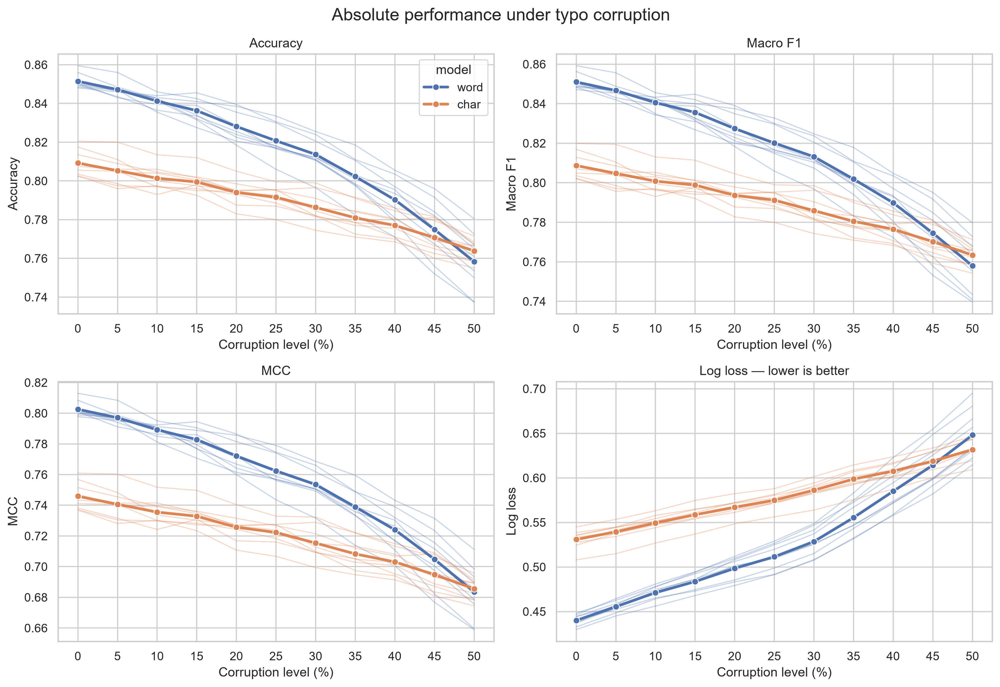
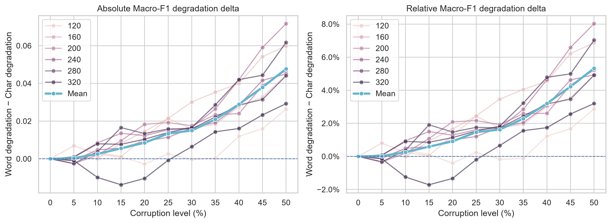

# Typo Robustness: Word vs Character Tokenization

This project is a controlled text-classification experiment comparing word-level and character-level tokenization under typographical noise.

**Research question:** When the model architecture and training data are held constant, does character-level tokenization preserve classification performance better than word-level tokenization as the typo rate increases?

The experiment was inspired by Chai et al.'s *Tokenization Falling Short: On Subword Robustness in Large Language Models*, which examines how tokenization makes language models sensitive to typographical and formatting variations.

## Experiment

The task is four-class news-topic classification on the AG News dataset. The notebook uses article descriptions only and creates balanced splits of 12,000 training, 2,000 validation, and 2,000 test examples.

Two 1D CNN classifiers use the same overall architecture—embedding, spatial dropout, convolution, global max pooling, dropout, and dense layers—but different input representations:

- **Word model:** whitespace tokenization, a vocabulary capped at 5,000 tokens, and sequences of 69 tokens.
- **Character model:** character tokenization, a vocabulary capped at 200 tokens, and sequences of 443 tokens.

The sequence lengths cover at least 99% of the training descriptions at their respective representation levels. Both models use 32-dimensional embeddings, 128 convolution filters, a kernel size of 5, and a 64-unit dense layer.

Each model is trained with nine seeds. At evaluation time, 0% to 50% of words are corrupted in five-percentage-point increments. A corrupted word receives an adjacent-character swap, QWERTY-neighbor substitution, deletion, or insertion, selected with equal probability. In addition, 7.5% of words of at least five characters receive a second, non-adjacent typo. The test sets are nested: increasing a corruption level retains the words corrupted at lower levels and adds more.

The notebook reports accuracy, macro precision, macro F1, Matthews correlation coefficient, log loss, training and inference resource use, paired McNemar tests with Holm correction, and an exact paired sign-flip permutation test of relative Macro-F1 degradation.

## Results

Results below are means across the nine training seeds from run `20260818_200405`.

| Words corrupted | Word accuracy | Character accuracy | Word macro F1 | Character macro F1 |
| ---: | ---: | ---: | ---: | ---: |
| 0% | 85.14% | 80.92% | 85.10% | 80.87% |
| 5% | 84.72% | 80.53% | 84.67% | 80.47% |
| 10% | 84.12% | 80.14% | 84.05% | 80.08% |
| 15% | 83.63% | 79.94% | 83.56% | 79.88% |
| 20% | 82.81% | 79.41% | 82.74% | 79.36% |
| 25% | 82.07% | 79.16% | 82.01% | 79.12% |
| 30% | 81.37% | 78.63% | 81.32% | 78.59% |
| 35% | 80.23% | 78.09% | 80.18% | 78.05% |
| 40% | 79.02% | 77.70% | 78.98% | 77.65% |
| 45% | 77.49% | 77.07% | 77.46% | 77.02% |
| 50% | 75.83% | 76.38% | 75.80% | 76.34% |



The word model begins 4.23 percentage points ahead in clean Macro F1, but degrades more rapidly. From clean text to 50% corruption, its Macro F1 falls by **9.30 percentage points**, compared with **4.53 points** for the character model. At 50% corruption, the character model leads by 0.54 points in Macro F1.

Across all nonzero corruption levels, the mean relative Macro-F1 degradation is **4.72%** for the word model and **2.74%** for the character model. The exact paired sign-flip test across seeds finds a mean difference of 1.99 percentage points in favor of the character model (`p = 0.0039`).



Positive values in the degradation-delta plot mean that the word model loses more performance than the character model.

This is not a capacity-matched comparison. The word model has 189,124 parameters versus 30,372 for the character model—**6.23× more**—because of its larger embedding vocabulary.However, due to the significantly longer sequences required by the character model as per the nature of the tokenization, the character model requires significantly more training and inference time.

## Replication

1. Clone the repository and enter its directory.
2. Use Python 3.12 to create and activate a virtual environment:

   ```powershell
   python -m venv .venv
   .\.venv\Scripts\Activate.ps1
   ```

3. Install the Python dependencies:

   ```powershell
   python -m pip install -r requirements.txt
   ```

4. Download the [AG News Classification Dataset from Kaggle](https://www.kaggle.com/datasets/amananandrai/ag-news-classification-dataset/data). Place `train.csv` and `test.csv` in `dataset/`.
5. Create the output directories if they are not already present:

   ```powershell
   New-Item -ItemType Directory -Force dataset, results/histories, artifacts/model_summaries, artifacts/models, figures | Out-Null
   ```

6. Start Jupyter and run every cell in the main notebook:

   ```powershell
   jupyter lab Typo_tokenization.ipynb
   ```

The configured seeds and deterministic TensorFlow operations make a run reproducible on the same software and hardware stack. Each run receives a timestamped ID and writes metrics, predictions, statistical tests, resource measurements, model files, vocabularies, training histories, and figures to `results/`, `artifacts/`, and `figures/`. CPU execution is intended given the small models.

## Technologies

- Python 3.12 and Jupyter
- TensorFlow and Keras
- NumPy and pandas
- scikit-learn and statsmodels
- Matplotlib and Seaborn
- psutil

## Project layout

```text
Typo_tokenization.ipynb       Main experiment and executed analysis
Typo_tokenization_test.ipynb  Development/test notebook
dataset/                      AG News train/test CSV files (not committed)
results/                      Metrics, predictions, statistical tests, and histories
artifacts/                    Configs, split IDs, vocabularies, model summaries, and models
figures/                      Generated plots
```

Dataset files and trained model files are excluded from version control; the notebook regenerates all result tables and figures.

## Future work

- Subword tokenization (on hold)

## License

This project is licensed under the [MIT License](LICENSE).

## References

1. Aman Anand Rai. *[AG News Classification Dataset](https://www.kaggle.com/datasets/amananandrai/ag-news-classification-dataset/data).* Kaggle, Version 2.
2. Yekun Chai, Yewei Fang, Qiwei Peng, and Xuhong Li. 2024. *[Tokenization Falling Short: On Subword Robustness in Large Language Models](https://aclanthology.org/2024.findings-emnlp.86/).* Findings of the Association for Computational Linguistics: EMNLP 2024, 1582–1599. Association for Computational Linguistics. [doi:10.18653/v1/2024.findings-emnlp.86](https://doi.org/10.18653/v1/2024.findings-emnlp.86).
