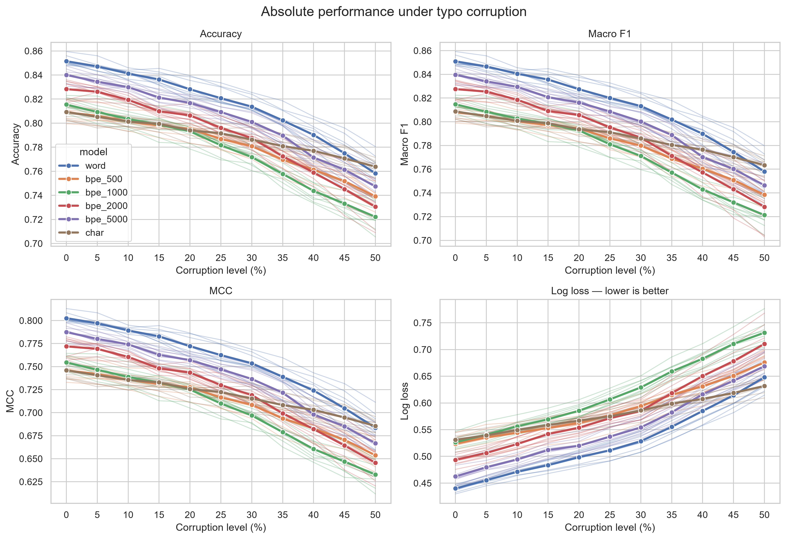
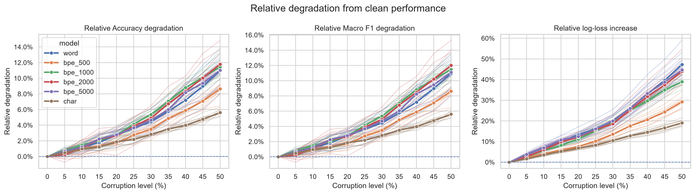

# Typo Robustness: Word vs BPE vs Character Tokenization

This project is a controlled text-classification experiment comparing word-level, byte-level BPE subword, and character-level tokenization under typographical noise. The BPE models sweep vocabulary sizes to measure how subword granularity affects robustness.

**Research question:** When the model architecture and training data are held constant, how do word, BPE, and character tokenization compare as the typo rate increases, and how does BPE vocabulary size affect robustness?

The experiment was inspired by Chai et al.'s *Tokenization Falling Short: On Subword Robustness in Large Language Models*, which examines how tokenization makes language models sensitive to typographical and formatting variations.

## Experiment

The task is four-class news-topic classification on the AG News dataset. The notebook uses article descriptions only and creates balanced splits of 12,000 training, 2,000 validation, and 2,000 test examples.

Six 1D CNN classifiers use the same overall architecture—embedding, spatial dropout, convolution, global max pooling, dropout, and dense layers—but different input representations:

- **Word model:** whitespace tokenization, a vocabulary capped at 5,000 tokens, and sequences of 69 tokens.
- **BPE models:** byte-level BPE trained only on the training split, with vocabulary sizes of 500, 1,000, 2,000, and 5,000. Their respective sequence lengths are 206, 157, 126, and 99 tokens.
- **Character model:** character tokenization, a vocabulary capped at 200 tokens, and sequences of 443 tokens.

The sequence lengths cover at least 99% of the training descriptions at their respective representation levels. All six models use 32-dimensional embeddings, 128 convolution filters, a kernel size of 5, and a 64-unit dense layer.

Each model is trained with nine seeds. At evaluation time, 0% to 50% of words are corrupted in five-percentage-point increments. A corrupted word receives an adjacent-character swap, QWERTY-neighbor substitution, deletion, or insertion, selected with equal probability. In addition, 7.5% of words of at least five characters receive a second, non-adjacent typo. The test sets are nested: increasing a corruption level retains the words corrupted at lower levels and adds more.

The notebook reports accuracy, macro precision, macro F1, Matthews correlation coefficient, log loss, training and inference resource use, paired McNemar tests with Holm correction, a Friedman omnibus test across BPE vocabulary sizes, and exact paired sign-flip tests of relative Macro-F1 degradation with Holm correction inside predefined comparison families.

## Results

Results below are means across the nine training seeds from run `20260820_052447`. Mean relative degradation averages each seed's clean-to-corrupted Macro-F1 loss across all nonzero corruption levels.

| Model | Clean accuracy | Accuracy at 50% | Clean macro F1 | Macro F1 at 50% | F1 drop | Mean relative degradation |
| --- | ---: | ---: | ---: | ---: | ---: | ---: |
| Word | **85.14%** | 75.83% | **85.10%** | 75.80% | 9.30 pp | 4.72% |
| BPE 500 | 80.90% | 73.91% | 80.80% | 73.84% | 6.96 pp | 3.69% |
| BPE 1,000 | 81.54% | 72.21% | 81.47% | 72.13% | 9.34 pp | 5.39% |
| BPE 2,000 | 82.83% | 73.05% | 82.76% | 72.82% | 9.94 pp | 5.25% |
| BPE 5,000 | 84.01% | 74.74% | 83.96% | 74.64% | 9.33 pp | 5.02% |
| Character | 80.92% | **76.38%** | 80.87% | **76.34%** | **4.53 pp** | **2.74%** |



The word model performs best on clean text, while the character model is the most robust and has the highest accuracy and Macro F1 at 50% corruption. The character model's mean relative Macro-F1 degradation is significantly lower than the word model's (`p = 0.0039`) and every BPE model's (Holm-adjusted `p = 0.0156` for each comparison).

Among the BPE models, vocabulary size has a significant overall effect on degradation (Friedman `p = 0.0021`). BPE 500 is more robust than BPE 1,000, 2,000, and 5,000 after Holm correction, although its clean-text performance is lower. It also degrades less than the word model (Holm-adjusted `p = 0.0312`); the other word-versus-BPE differences are not significant.



The comparison is architecture-controlled but not parameter- or compute-matched. Parameter counts range from 30,372 for the character model to 189,124 for the word and BPE 5,000 models. Smaller vocabularies reduce embedding parameters, while longer token sequences increase training and inference cost - most notably for the character model.

## Replication

1. Clone the repository and enter its directory.
2. Use Python 3.12 to create and activate a virtual environment:

   ```powershell
   python -m venv .venv
   .\.venv\Scripts\Activate.ps1
   ```

3. Install the Python dependencies:

   ```powershell
   python -m pip install -r requirements.txt
   ```

4. Download the [AG News Classification Dataset from Kaggle](https://www.kaggle.com/datasets/amananandrai/ag-news-classification-dataset/data). Place `train.csv` and `test.csv` in `dataset/`.
5. Create the output directories if they are not already present:

   ```powershell
   New-Item -ItemType Directory -Force dataset, results/histories, artifacts/model_summaries, artifacts/models, figures | Out-Null
   ```

6. Start Jupyter and run every cell in the main notebook:

   ```powershell
   jupyter lab Typo_tokenization.ipynb
   ```

The configured seeds and deterministic TensorFlow operations make a run reproducible on the same software and hardware stack. Each run receives a timestamped ID and writes metrics, predictions, statistical tests, resource measurements, model files, vocabularies, training histories, and figures to `results/`, `artifacts/`, and `figures/`. CPU execution is intended given the small models.

## Technologies

- Python 3.12 and Jupyter
- TensorFlow and Keras
- Hugging Face Tokenizers
- NumPy and pandas
- SciPy, scikit-learn, and statsmodels
- Matplotlib and Seaborn
- psutil

## Project layout

```text
Typo_tokenization.ipynb       Main experiment and executed analysis
Typo_tokenization_test.ipynb  Development/test notebook
dataset/                      AG News train/test CSV files (not committed)
results/                      Metrics, predictions, statistical tests, and histories
artifacts/                    Configs, split IDs, vocabularies, model summaries, and models
figures/                      Generated plots
```

Dataset files and trained model files are excluded from version control; the notebook regenerates all result tables and figures.

## License

This project is licensed under the [MIT License](LICENSE).

## References

1. Aman Anand Rai. *[AG News Classification Dataset](https://www.kaggle.com/datasets/amananandrai/ag-news-classification-dataset/data).* Kaggle, Version 2.
2. Yekun Chai, Yewei Fang, Qiwei Peng, and Xuhong Li. 2024. *[Tokenization Falling Short: On Subword Robustness in Large Language Models](https://aclanthology.org/2024.findings-emnlp.86/).* Findings of the Association for Computational Linguistics: EMNLP 2024, 1582–1599. Association for Computational Linguistics. [doi:10.18653/v1/2024.findings-emnlp.86](https://doi.org/10.18653/v1/2024.findings-emnlp.86).
